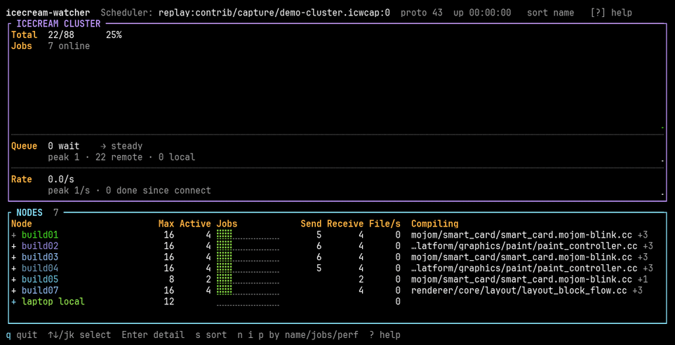

# icecream-watcher

A terminal monitor for [Icecream](https://github.com/icecc/icecream) (`icecc`)
distributed compile clusters — the cluster equivalent of `btop`, where each
build node reads like a process.

**Status: Phase 6.** Cluster band, dot bars and graphs, sorting, keyboard
navigation, a per-node detail view, and failure handling that keeps the screen
honest when the cluster or the network misbehaves. See
[ARCHITECTURE.md](ARCHITECTURE.md) for the design and the roadmap.



That is the binary itself, replaying a captured scheduler stream: seven nodes
fill up, saturate, drain, and one of them opens its detail view. Nothing in it
is drawn by hand — see [contrib/demo/](contrib/demo/) to rebuild it.

The same screen as text, which the rest of this section reads through:

```
icecream-watcher  Scheduler: build-master:8765  NetName: ICECREAM  proto 43  up 00:00:00   sort name   [?] help
┌ ICECREAM CLUSTER ──────────────────────────────────────────────────────────────────────────────────────────────────┐
│Total  38/88      43%                     ⠀⠀⠀⠀⠀⠀⠀⠀⠀⠀⠀⠀⠀⠀⠀⠀⠀⠀⠀⠀⠀⠀⠀⠀⠀⠀⠀⠀⠀⠀⠀⠀⠀⠀⠀⠀⠀⠀⠀⠀⠀⠀⠀⠀⠀⠀⠀⠀⠀⠀⠀⠀⠀⠀⠀⠀⠀⠀⠀⠀⠀⠀⠀⠀⠀⠀⠀⠀⠀⠀⠀⠀⠀⠀│
│Jobs   7 online                           ⠀⠀⠀⠀⠀⠀⠀⠀⠀⠀⠀⠀⠀⠀⠀⠀⠀⠀⠀⠀⠀⠀⠀⠀⠀⠀⠀⠀⠀⠀⠀⠀⠀⠀⠀⠀⠀⠀⠀⠀⠀⠀⠀⠀⠀⠀⠀⠀⠀⠀⠀⠀⠀⠀⠀⠀⠀⠀⠀⠀⠀⠀⠀⠀⠀⠀⠀⠀⠀⠀⠀⠀⠀⠀│
│                                          ⠀⠀⠀⠀⠀⠀⠀⠀⠀⠀⠀⠀⠀⠀⠀⠀⠀⠀⠀⠀⠀⠀⠀⠀⠀⠀⠀⠀⠀⠀⠀⠀⠀⠀⠀⠀⠀⠀⠀⠀⠀⠀⠀⠀⠀⠀⠀⠀⠀⠀⠀⠀⠀⠀⠀⠀⠀⠀⠀⠀⠀⠀⠀⠀⠀⠀⠀⠀⠀⠀⠀⠀⠀⠀│
│                                          ⠀⠀⠀⠀⠀⠀⠀⠀⠀⠀⠀⠀⠀⠀⠀⠀⠀⠀⠀⠀⠀⠀⠀⠀⠀⠀⠀⠀⠀⠀⠀⠀⠀⠀⠀⠀⠀⠀⠀⠀⠀⠀⠀⠀⠀⠀⠀⠀⠀⠀⠀⠀⠀⠀⠀⠀⠀⠀⠀⠀⠀⠀⠀⠀⠀⠀⠀⠀⠀⠀⠀⠀⠀⠀│
│                                          ⠀⠀⠀⠀⠀⠀⠀⠀⠀⠀⠀⠀⠀⠀⠀⠀⠀⠀⠀⠀⠀⠀⠀⠀⠀⠀⠀⠀⠀⠀⠀⠀⠀⠀⠀⠀⠀⠀⠀⠀⠀⠀⠀⠀⠀⠀⠀⠀⠀⠀⠀⠀⠀⠀⠀⠀⠀⠀⠀⠀⠀⠀⠀⠀⠀⠀⠀⠀⠀⠀⠀⠀⠀⠀│
│                                          ⠀⠀⠀⠀⠀⠀⠀⠀⠀⠀⠀⠀⠀⠀⠀⠀⠀⠀⠀⠀⠀⠀⠀⠀⠀⠀⠀⠀⠀⠀⠀⣿⣿⣿⣿⣿⣿⣿⣿⣿⣿⣿⣿⣿⣿⣿⣿⣿⣿⣿⣿⣿⣿⣿⣿⣿⣿⣿⣿⣿⣿⣿⣿⣿⣿⣿⣿⣿⣿⣿⣿⣿⣿⣿│
│                                          ⠀⠀⠀⠀⠀⠀⠀⠀⠀⠀⠀⠀⠀⠀⠀⠀⠀⠀⠀⠀⠀⠀⠀⠀⠀⠀⠀⠀⠀⠀⠀⣿⣿⣿⣿⣿⣿⣿⣿⣿⣿⣿⣿⣿⣿⣿⣿⣿⣿⣿⣿⣿⣿⣿⣿⣿⣿⣿⣿⣿⣿⣿⣿⣿⣿⣿⣿⣿⣿⣿⣿⣿⣿⣿│
│                                          ⠀⠀⠀⠀⠀⠀⠀⠀⠀⠀⠀⠀⠀⠀⠀⠀⠀⠀⠀⠀⠀⠀⠀⠀⠀⠀⠀⠀⠀⠀⠀⣿⣿⣿⣿⣿⣿⣿⣿⣿⣿⣿⣿⣿⣿⣿⣿⣿⣿⣿⣿⣿⣿⣿⣿⣿⣿⣿⣿⣿⣿⣿⣿⣿⣿⣿⣿⣿⣿⣿⣿⣿⣿⣿│
│                                          ⠀⠀⠀⠀⠀⠀⠀⠀⠀⠀⠀⠀⠀⠀⠀⠀⠀⠀⠀⠀⠀⠀⠀⠀⠀⠀⠀⠀⠀⠀⠀⣿⣿⣿⣿⣿⣿⣿⣿⣿⣿⣿⣿⣿⣿⣿⣿⣿⣿⣿⣿⣿⣿⣿⣿⣿⣿⣿⣿⣿⣿⣿⣿⣿⣿⣿⣿⣿⣿⣿⣿⣿⣿⣿│
│┈┈┈┈┈┈┈┈┈┈┈┈┈┈┈┈┈┈┈┈┈┈┈┈┈┈┈┈┈┈┈┈┈┈┈┈┈┈┈┈┈┈┈┈┈┈┈┈┈┈┈┈┈┈┈┈┈┈┈┈┈┈┈┈┈┈┈┈┈┈┈┈┈┈┈┈┈┈┈┈┈┈┈┈┈┈┈┈┈┈┈┈┈┈┈┈┈┈┈┈┈┈┈┈┈┈┈┈┈┈┈┈┈┈┈┈│
│Queue  7 wait    → steady                 ⠀⠀⠀⠀⠀⠀⠀⠀⠀⠀⠀⠀⠀⠀⠀⠀⠀⠀⠀⠀⠀⠀⠀⠀⠀⠀⠀⠀⠀⠀⠀⣿⣿⣿⣿⣿⣿⣿⣿⣿⣿⣿⣿⣿⣿⣿⣿⣿⣿⣿⣿⣿⣿⣿⣿⣿⣿⣿⣿⣿⣿⣿⣿⣿⣿⣿⣿⣿⣿⣿⣿⣿⣿⣿│
│       peak 7 · 38 remote · 0 local       ⠀⠀⠀⠀⠀⠀⠀⠀⠀⠀⠀⠀⠀⠀⠀⠀⠀⠀⠀⠀⠀⠀⠀⠀⠀⠀⠀⠀⠀⠀⠀⣿⣿⣿⣿⣿⣿⣿⣿⣿⣿⣿⣿⣿⣿⣿⣿⣿⣿⣿⣿⣿⣿⣿⣿⣿⣿⣿⣿⣿⣿⣿⣿⣿⣿⣿⣿⣿⣿⣿⣿⣿⣿⣿│
│┈┈┈┈┈┈┈┈┈┈┈┈┈┈┈┈┈┈┈┈┈┈┈┈┈┈┈┈┈┈┈┈┈┈┈┈┈┈┈┈┈┈┈┈┈┈┈┈┈┈┈┈┈┈┈┈┈┈┈┈┈┈┈┈┈┈┈┈┈┈┈┈┈┈┈┈┈┈┈┈┈┈┈┈┈┈┈┈┈┈┈┈┈┈┈┈┈┈┈┈┈┈┈┈┈┈┈┈┈┈┈┈┈┈┈┈│
│Rate   0.0/s                              ⠀⠀⠀⠀⠀⠀⠀⠀⠀⠀⠀⠀⠀⠀⠀⠀⠀⠀⠀⠀⠀⠀⠀⠀⠀⠀⠀⠀⠀⠀⠀⣿⠀⠀⠀⠀⠀⠀⠀⠀⠀⠀⠀⠀⠀⠀⠀⠀⠀⠀⠀⠀⠀⠀⠀⠀⠀⠀⠀⠀⠀⠀⠀⠀⠀⠀⠀⠀⠀⠀⠀⠀⠀⠀│
│       peak 40/s · building for 0s        ⠀⠀⠀⠀⠀⠀⠀⠀⠀⠀⠀⠀⠀⠀⠀⠀⠀⠀⠀⠀⠀⠀⠀⠀⠀⠀⠀⠀⠀⠀⠀⣿⣀⣀⣀⣀⣀⣀⣀⣀⣀⣀⣀⣀⣀⣀⣀⣀⣀⣀⣀⣀⣀⣀⣀⣀⣀⣀⣀⣀⣀⣀⣀⣀⣀⣀⣀⣀⣀⣀⣀⣀⣀⣀│
└────────────────────────────────────────────────────────────────────────────────────────────────────────────────────┘
┌ NODES  7 ──────────────────────────────────────────────────────────────────────────────────────────────────────────┐
│Node                        Max Active Jobs            Send Receive File/s  Compiling                               │
│+ build01                    16     15 ⣿⣿⣿⣿⣿⣿⣿⣿⣿⣿⣿⣇      48      23      0  …rt_card/smart_card.mojom-blink.cc +14  │
│+ build02                    16     10 ⣿⣿⣿⣿⣿⣿⣿⣇⣀⣀⣀⣀              18      0  …web_sensor_provider.mojom-blink.cc +9  │
│+ build03                    16      8 ⣿⣿⣿⣿⣿⣿⣀⣀⣀⣀⣀⣀              16      0  …ebaudio/audio_worklet_processor.cc +7  │
│+ build04                    16      4 ⣿⣿⣿⣀⣀⣀⣀⣀⣀⣀⣀⣀       9      12      0  …ebaudio/audio_worklet_processor.cc +3  │
│+ build05                     8        ⣀⣀⣀⣀⣀⣀⣀⣀⣀⣀⣀⣀               8      0                                          │
│+ build07                    16        ⣀⣀⣀⣀⣀⣀⣀⣀⣀⣀⣀⣀      10              0                                          │
│+ laptop local               12      1 ⣿⣀⣀⣀⣀⣀⣀⣀⣀⣀⣀⣀      11       1      0  …r/core/css/resolver/style_resolver.cc  │
│                                                                                                                    │
└────────────────────────────────────────────────────────────────────────────────────────────────────────────────────┘
q quit  ↑↓/jk select  Enter detail  s sort  n i p by name/jobs/perf  ? help   selected build02
```

Reading it: every column is an **Icecream** figure — compile slots, jobs
submitted from here (`Send`) and compiled here for the cluster (`Receive`),
files finished per second, and the file each node is working on. A node whose `Send` is empty
is a pure compile server: it takes work and sends none. Across a cluster the
`Receive` figures sum to the `Send` figures, so a mismatch means an attribution
was lost, not that a node is idle.

**A zero counter is blank, and `—` means unknown.** They are different facts and
this table shows both on the same row: an empty `Send` says the answer is known
and it is none, while a `—` says there is no figure to show at all.
The name column is sized to the cluster rather than to a fixed maximum, so
nothing is padded out with cells that nothing fills.
How fast one file is on a node, and how that compares with its peers, is in the
detail view. `build05` and `build07` are finishing nothing because nothing is
being sent to them, which the `0` says and the empty meter beside it confirms.
Everything here comes from the scheduler, so there is nothing to install on the
build nodes.

**A node that goes offline leaves the list**, and comes back by itself when its
daemon reattaches. Host ids are per *connection* — the scheduler issues a new one
every time a daemon attaches — so a laptop that sleeps and wakes would otherwise
leave a struck-through copy of itself behind on every cycle, until a morning of
that is a screen of one machine's remains crowding out the nodes that are
running. Only what is here now is counted: a tally of departures sat beside the
online count for a while and misled, because a laptop that sleeps and wakes is
counted as a departure every cycle while the same machine is still in the list.

`Max` and `Active` carry the job counts as plain numbers, and the `Jobs` meter
beside them is **a fraction**: the same width on every row, filled by how full
the node is. It was a cell per slot, which made the length of the filled run an
absolute job count while the eye read it as a fraction — eight slots all busy
drew a shorter run than twelve slots with nine busy, so the node with nothing
left to give looked like the quieter one. Comparing rows is the whole reason the
column is a bar rather than a figure. Its colour ramps with the same fraction,
green through yellow to red, so a saturated machine is picked out of a list
without reading a figure. Braille resolves to half a cell, so the bar says twice
what its width in characters suggests.

The gradient is 24-bit colour by default so that it is actually gradual; pass
`--colors-256` on a terminal that cannot show it and the ramp rounds to the
216-colour cube instead.

**Each node is drawn in its own colour**, keyed by hostname so it follows the
machine through a re-sort, through other nodes coming and going, and between
sessions. The palette is blues, greens, cyans and purples only: red, orange and
yellow mean *state* here — a problem badge, a saturated metric, a hot sensor — and
a healthy node that happened to hash into that range would read as a node in
trouble.

`Compiling` names **what each node is working on right now**. One name, not a list: a
row is a strip, and the job that has been running longest is both the one worth
naming — it answers "what is taking so long" — and the one most likely to still
be there on the next frame, so the column can be read instead of flickering. The
rest are counted as `+n`, and the detail view names them. Long paths are cut at
the front, because the file is at the end and the directories in front of it are
shared by hundreds of others. A node compiling only for itself shows nothing
here, the way it occupies no slot in the meter.

Narrower terminals drop whole columns rather than squeezing every one into
uselessness; spare width goes to hostnames first, because an elided name costs
more than a shorter path.

The `+` before every hostname says the row has more behind it. The detail view
was reachable and invisible before it: the footer named the key, but nothing on
the row itself said there was anything to open.

`Enter` opens the node the overview points at. The meter says how many slots are
busy and whose work is in them; this says **which file each slot is compiling**,
for how long, and everything the scheduler reports about the node itself:

```
icecream-watcher  Scheduler: build-master:8765  NetName: ICECREAM  proto 43  up 00:00:00   sort name   [?] help
┌ build02  10.0.0.2  x86_64  proto 43 ───────────────────────────────────────────────────────────────────────────────┐
│  healthy                                                                                                           │
│                                                                                                                    │
│JOBS                                                                                                                │
│    Job   1  (   0.1s)  mojom/sensor/web_sensor_provider.mojom-blink.cc  · from laptop                              │
│    Job   2  (   0.1s)  mojom/smart_card/smart_card.mojom-blink.cc  · from build07                                  │
│    Job   3  (   0.1s)  renderer/modules/webaudio/audio_worklet_processor.cc  · from build01                        │
│    Job   4  (   0.1s)  renderer/core/layout/layout_block_flow.cc  · from build04                                   │
│    Job   5  (   0.1s)  mojom/serial/serial.mojom-blink.cc  · from laptop                                           │
│    Job   6  (   0.1s)  renderer/platform/graphics/paint/paint_controller.cc  · from build07                        │
│    Job   7  (   0.1s)  renderer/core/css/resolver/style_resolver.cc  · from build01                                │
│    Job   8  (   0.1s)  mojom/speculation_rules/speculation_rules.mojom-blink.cc  · from build04                    │
│    Job   9  (   0.1s)  mojom/sensor/web_sensor_provider.mojom-blink.cc  · from laptop                              │
│    Job  10  (   0.1s)  mojom/smart_card/smart_card.mojom-blink.cc  · from build07                                  │
│    6 of 16 slots free                                                                                              │
│                                                                                                                    │
│NODE                                                                                                                │
│    name              build02                                                                                       │
│    IP                10.0.0.2                                                                                      │
│    platform          x86_64                                                                                        │
│    protocol          43                                                                                            │
│    features          env_xz env_zstd                                                                               │
│    max jobs          16                                                                                            │
│    accepts remote    yes                                                                                           │
│    measured speed    85 KB of object per CPU-second, over 8 jobs  (1.0x the x86_64 median)                         │
│    scheduler speed   2900.0 — the scheduler's own estimate of this machine                                         │
│    load              610 of 1000 — the scheduler's placement weight                                                │
└────────────────────────────────────────────────────────────────────────────────────────────────────────────────────┘
Esc/q back  ↑↓/jk scroll  Ctrl-C quit   build02
```

Below the fold the `NODE` section continues with free memory and the job counters
since this monitor connected. This is where a machine's own figures live — the
load average, for one, because a load average is absolute and a column of them
in the overview would invite a comparison that cannot be made. Anything wrong
with the node, such as no ack from the scheduler, is stated at the top, before
the numbers it would explain.

Only jobs this monitor saw *start* appear in the list. The scheduler replays node
stats when a monitor logs in but not jobs, so anything already compiling when you
attached stays invisible until it finishes, and the panel says how many of those
it has seen end.

## Build

Needs a Rust toolchain (1.75+). No `libicecc` and no C++ build dependencies —
the scheduler protocol is implemented natively.

```sh
cargo build --release
./target/release/icecream-watcher
```

## Use

```sh
icecream-watcher                                   # discover via UDP broadcast
icecream-watcher --scheduler build-master:8765     # connect directly
icecream-watcher --netname MYFARM                  # discover on a named network
ICECC_SCHEDULER=build-master:8765 icecream-watcher # same as --scheduler
```

Discovery follows Icecream's own rules: an explicit `--scheduler` wins, then
`$ICECC_SCHEDULER`, then `$USE_SCHEDULER`, otherwise a broadcast for netname
`$ICECC_NETNAME` (default `ICECREAM`). Unlike `icecream-sundae`, the port is not
hardcoded — `host:port` works everywhere, including a bare `:8767` to broadcast
on a non-default port.

Other flags:

| Flag | Purpose |
|---|---|
| `--dump` | print events as text instead of drawing a TUI |
| `--record FILE` | save the raw protocol stream for offline replay |
| `--replay FILE` | replay a capture instead of connecting |
| `--log-file FILE` | write diagnostics (never to the terminal, which would corrupt the display) |
| `--colors-256` | round the load gradient to the 216-colour cube |
| `--job-timeout SECS` | forget a job whose completion never arrives (default 1800; 0 disables) |
| `--reconnect-max-delay SECS` | ceiling on the reconnect backoff (default 30) |

## What is not here

CPU utilisation, memory, temperature, frequency, swap and network throughput are
not in the Icecream monitor protocol, so this does not show them. Getting them
would mean running something on every build node, which is a different tool with
a different deployment story — and the point of this one is that watching a
cluster costs nothing but a TCP connection to the scheduler.

What the protocol does carry turns out to answer most of the question anyway.
`File/s` is counted from job completions, so how fast a node actually is comes
out of the work it finishes rather than out of a sensor reading.

### Keys

| Key | Action |
|---|---|
| `q`, `Esc` | back out one step: the help overlay, the detail view, the highlighted row — then ask to quit |
| `Ctrl-C` | quit, from wherever you are, without asking |
| `↑` / `k`, `↓` / `j` | move the selection, or scroll the detail view |
| `PgUp` / `PgDn` | move or scroll ten rows |
| `s` | cycle the sort key |
| `n`, `i`, `p` | sort by name, jobs, perf |
| `r` | redraw; while disconnected, retry the connection now |
| `?` | help |
| `Enter` | open or close the node detail view |

`q` asks before it goes. A monitor is something people leave running for a day
and every counter on the screen is "since connect", so a stray keystroke costs
the whole session's history; only `y` answers the prompt, and `Ctrl-C` skips it.

Only figures the table shows can be sorted on: sorting by CPU, memory, or the
scheduler's placement weight went with the columns that showed them, because a
list that reorders itself by a number the reader cannot see is worse than one
with fewer orderings. Metric
sorts put the busiest node first, since the reason to sort by load is to see
what is loaded. Nodes with no measurement sort last rather than being flipped
to the top. The selection follows
its node through a re-sort.

## Reading the screen

- `—` and `····` mean **not measured**, never zero. A node that has compiled
  nothing yet reads `0` on `File/s`, which is measured; a figure that does
  not exist at all reads `—`. The two must not look the same.
- `!` marks a node well below its platform's median in the detail view.
- **Dim rows are idle.** Offline rows strike through and sink to the bottom.
- **`Jobs`** is remote compiles running as a fraction of slots offered. Local
  compiles occupy no scheduler slot and are counted separately.
- **`File/s`** is what it says: files this node finished per second, averaged
  over the last ten seconds. Work the cluster placed and work the machine kept
  for itself both count, because a file finished is a file finished — and
  because the headline `Rate` in the band counts both, and averages the same ten
  seconds, so the column adds up to it and can be checked by eye. It measures **contribution, not speed** — a
  thirty-two slot machine chewing easy files beats a fast twelve-slot one on
  hard ones, and a node nobody is sending work to reads `0` however quick it is.
  What one file costs on a node, and how that compares with its peers on the
  same platform, is in the detail view.
- The **`Queue`** and **`Rate`** graphs are scaled to their own peak — a queue has
  no natural maximum — and the peak is printed next to them so a flat graph at
  full height cannot be mistaken for a queue at some limit.
- Badges after a node name: `down`, `local` (refuses remote jobs), `no ack` (the
  scheduler has pinged it and is still waiting), `local` (it refuses remote jobs
  row's metrics may belong to another machine).
- Cumulative counters are **since connect**. Job ids only mean anything within
  one scheduler session, so a reconnect necessarily resets them.

The scheduler's own `Load` field — a composite 0–1000 scheduling weight,
`max(1000 - idle, memory pressure)`, forced to 1000 when a node is low on disk —
is deliberately **not** shown as a bar, or sorted on. It is not CPU utilisation,
and drawing it as one would be a confidently wrong picture. It is in the detail
view, labelled for what it is.

## Notes on connecting

The first connection to an **idle** scheduler can take up to ~36 seconds. That
is upstream behaviour, not a hang: the scheduler stops polling its listen socket
for a second after each accept, then blocks in `poll()` for up to
`MAX_SCHEDULER_PING`, and with no daemons attached nothing wakes it. Once
daemons are connected the handshake is immediate. `icecream-watcher` shows
`handshaking…` while it waits and defaults `--handshake-timeout` to 45 s;
lowering it will make idle clusters look dead.

## When things go wrong

The screen is meant to stay honest, which mostly means never showing a
confident number it has not checked.

**A severed link.** Scheduler stats are change-driven, so an idle cluster and a
pulled cable both send nothing. TCP keepalive settles it: a vanished scheduler
becomes a visible `disconnected` in about 35 seconds instead of leaving a
plausible, frozen cluster on screen. Silence that is merely silence is labelled
`quiet 5m` in the header once it passes a minute.

**A scheduler that is gone.** Reconnection backs off 1, 2, 4 … up to
`--reconnect-max-delay`, so a monitor left running overnight does not spend the
night broadcasting. A session that reached login resets the backoff, so a
*restarted* scheduler is picked up within a second or two; only a genuinely
absent one is backed off. The header shows the countdown and the attempt number,
and `r` cuts the wait short.

**A different scheduler.** If discovery lands somewhere new, the header says
`⇄ moved from <old>`: every host id, node and counter now belongs to another
cluster, which is not something to discover by noticing the numbers changed.

**A job that never finishes.** The protocol does not guarantee that every job
you are told about is one you are told the end of, and a stuck job would inflate
the queue depth for the rest of the session. Jobs expire after
`--job-timeout` — generously, because expiring early understates the queue just
as badly — and the count is logged rather than hidden.

## Layout

| Crate | Contents |
|---|---|
| `crates/icecc-proto` | the scheduler monitor protocol: framing, handshake, message decoders, discovery. No UI. |
| `crates/icecc-metrics` | the node metrics wire format, plus a minimal client |
| `crates/icecc-model` | cluster state and job accounting |
| `crates/icecream-watcher` | the TUI |

`icecc-proto` is deliberately independent of the rest and is the piece most
likely to be useful to other tools.

## Testing

```sh
cargo test
```

The text screenshot above is real output from the renderer, not a mock-up;
regenerate it with
`cargo test -p icecream-watcher screenshot -- --ignored --nocapture`. The GIF is
the binary running, rebuilt with `contrib/demo/record.sh`; see
[contrib/demo/README.md](contrib/demo/README.md) for what that needs.

Protocol tests run against bytes captured from a real scheduler
(`contrib/capture/`), so they need no cluster — see
[contrib/capture/README.md](contrib/capture/README.md). The `/proc` and `/sys`
parsers are tested against captured file contents and the sampler against
fixture directories, so neither depends on the machine running the tests.

## Licence

GPL-2.0-or-later. The protocol and the job-accounting model are derived from
Icecream, `icemon` and `icecream-sundae`, all GPL-2.0-or-later.
